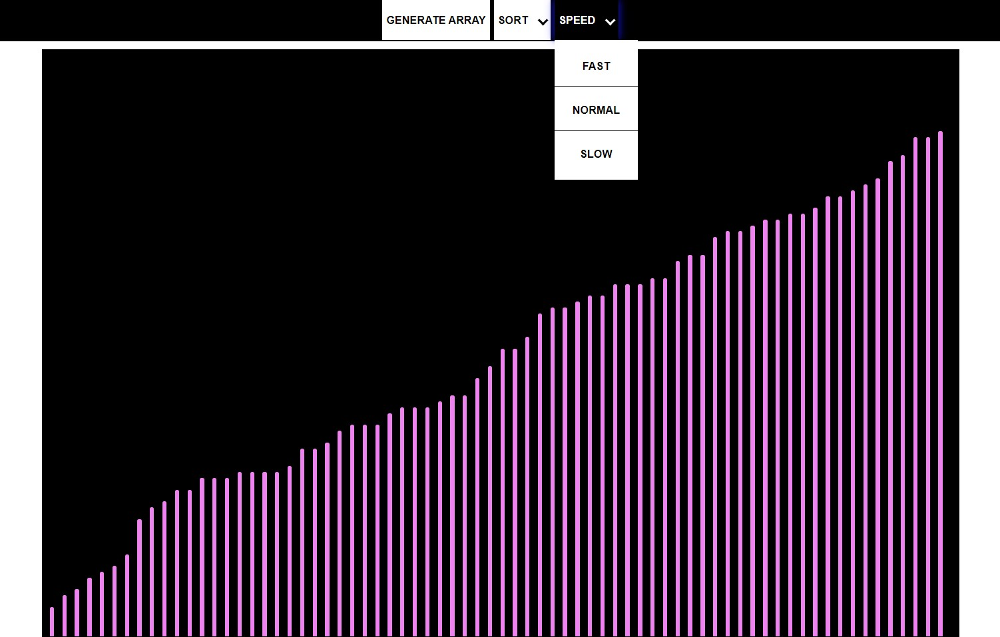

# SortingVisualizer
Visualizer of Sorting Algorithms made using Pure Vanilla JavaScript.

## Introduction
It is a project to help learn shorting algorithms by implementing the algorithms but also tweak with the algorithm so that you can perform the animations required to visualize the algorithms

It have bunch of li elements whose length is represented by the value of array and we need to implement shorting algorithm to arrange the li elements in shorted fashion

## Features 

* Algorithms included : Bubble sort, Insertion sort, Selection sort, Quick sort, Merge sort.
* Speed of the algorithm & animation can be increased or decreased

## Preview :computer:

