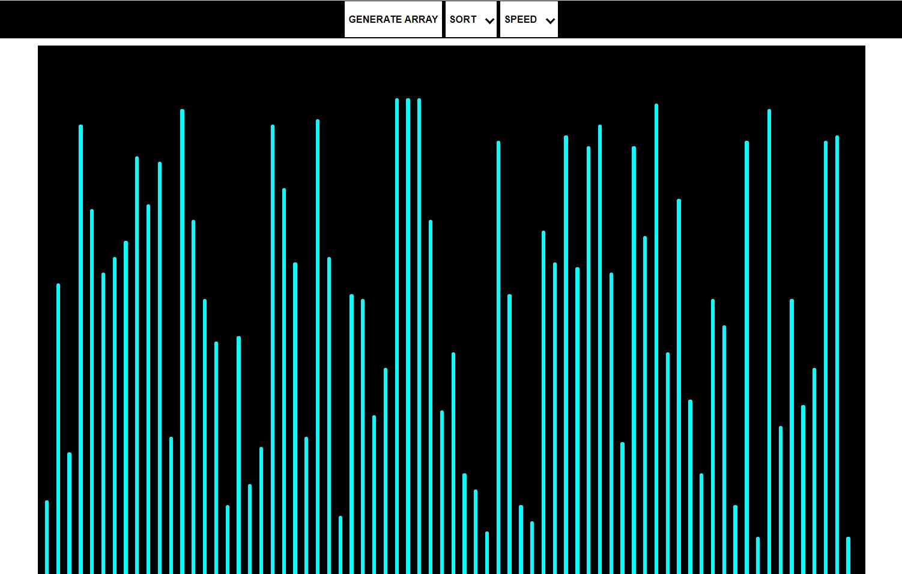
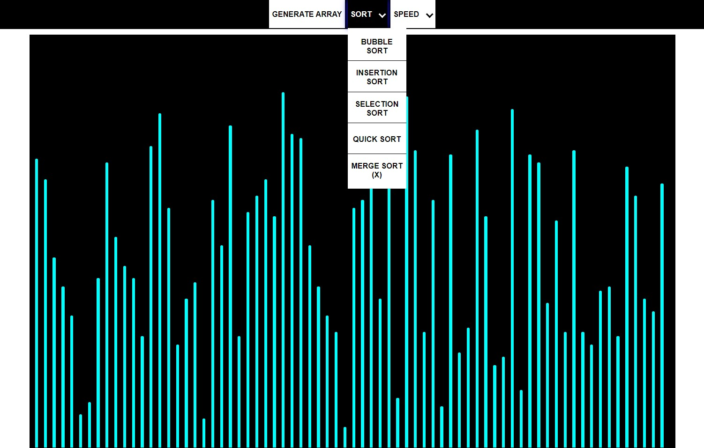

# SortingVisualizer
Visualizer of Sorting Algorithms made using Pure Vanilla JavaScript.

Live @ [https://aryaraj132.github.io/SortingVisualizer/](https://aryaraj132.github.io/SortingVisualizer/)

## Introduction
This project creates animated visualizations in order to teach users how various sorting algorithms work. Users can select from several sorting algorithms and watch them run in real time (speed is adjustable). By watching how each algorithm sorts bars in ascending height, users gain a deep and intuitive understanding of the underlying logic of these algorithms and their relative efficiencies.

## Implementation
Sort functions are implemented in JavaScript. Bars of differing heights are represented by &lt;li> elements and derive their height values from an array. Sorting algorithms direct re-rendering of bar elements until they appear in sorted order, thereby illustrating the sorting process.

## Features 

* Algorithms included: Bubble sort, Insertion sort, Selection sort, Quick sort, Merge sort.
* Speed of the algorithm animation can be increased or decreased

 <h2> Preview </h2>

